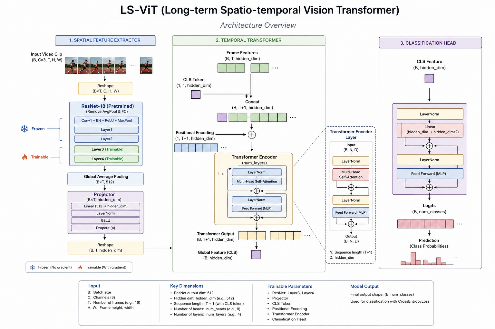
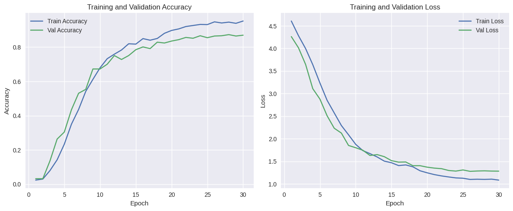
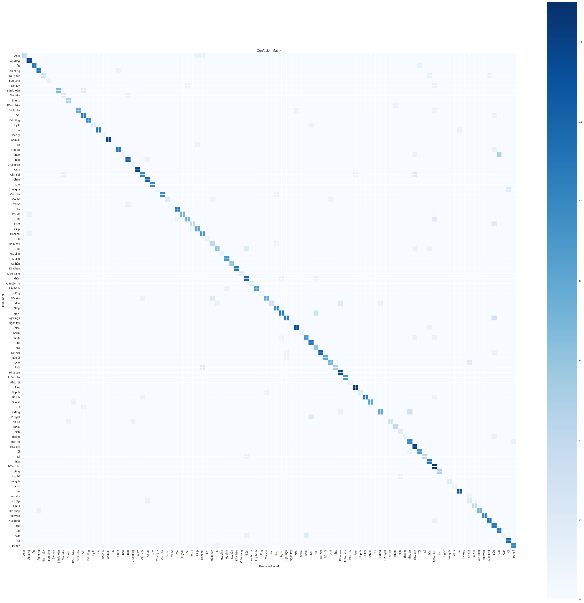

# Sign Language Recognition — LS-ViT

Nhận diện ngôn ngữ ký hiệu từ video sử dụng kiến trúc **LS-ViT** (Long-term Spatio-temporal Vision Transformer).

---

## Kiến trúc mô hình


LS-ViT gồm 3 thành phần chính:

**1. Spatial Feature Extractor**
- ResNet18 pretrained (bỏ AvgPool và FC layer)
- Layer1 + Layer2: **frozen**
- Layer3 + Layer4: **trainable**
- Output qua Global Average Pooling → shape `(B×T, 512)`
- Projector: `Linear(512 → hidden_dim)` → `LayerNorm` → `GELU` → `Dropout`

**2. Temporal Transformer**
- CLS token được concat vào đầu chuỗi frame features
- Positional Encoding shape `(1, T+1, hidden_dim)`
- Transformer Encoder gồm `num_layers` lớp, mỗi lớp: `LayerNorm` → `Multi-Head Self-Attention` → `LayerNorm` → `Feed Forward (MLP)`

**3. Classification Head**
- Lấy CLS token từ output Transformer
- `LayerNorm` → `Linear(hidden_dim → hidden_dim/2)` → `Feed Forward (MLP)` → Logits

| Thành phần         | Chi tiết                                      |
|--------------------|-----------------------------------------------|
| Backbone           | ResNet18 (pretrained ImageNet)                |
| Frozen layers      | Layer1, Layer2                                |
| Trainable layers   | Layer3, Layer4, Projector, Transformer, Head  |
| Hidden dim         | 512                                           |
| Transformer heads  | 8                                             |
| Transformer layers | 4                                             |
| Activation         | GELU                                          |
| Dropout            | 0.3                                           |
| Input frames       | 16 frames / video                             |
| Input size         | 224 × 224                                     |

---

## Kết quả

| Metric            | Giá trị        |
|-------------------|----------------|
| Overall Accuracy  | **86.72%**     |
| Total samples     | 768            |

**Training & Validation Accuracy / Loss:**



**Confusion Matrix:**



---

## Cấu hình training

| Tham số       | Giá trị                                      |
|---------------|----------------------------------------------|
| Optimizer     | AdamW                                        |
| Learning rate | backbone: 1e-5 / các layer khác: 1e-4        |
| Weight decay  | 1e-2                                         |
| Scheduler     | CosineAnnealingLR                            |
| Epochs        | 30                                           |
| Batch size    | 8                                            |
| Precision     | AMP (Automatic Mixed Precision)              |

---

## Dataset

Dataset: [Sign Language – captainviet](https://www.kaggle.com/datasets/captainviet/sign-language)

Cấu trúc thư mục gốc:

```
dataraw/
├── train/
│   ├── <label_1>/
│   │   ├── video1.mp4
│   │   └── ...
│   └── <label_n>/
└── label_mapping.pkl
```

Tỉ lệ split: **Train / Val / Test** theo stratified split.

---

## Cài đặt

```bash
git clone https://github.com/hoanggvanviet/sign_recognition.git
cd sign_recognition
pip install -r requirements.txt
```

> Nếu dùng GPU, cài PyTorch theo CUDA version tại [pytorch.org](https://pytorch.org/get-started/locally/) trước khi chạy lệnh trên.

---

## Chạy notebook

Notebook được thiết kế để chạy trên **Kaggle**. Sau khi thêm dataset vào Kaggle notebook, chạy tuần tự các cell.

Checkpoint tự động lưu theo epoch tốt nhất (dựa trên val F1). Nếu notebook bị ngắt, training sẽ resume từ checkpoint gần nhất.

---

## Cấu trúc project

```
sign_recognition/
├── models/          # file .pth sau khi train (không commit lên git)
├── results/         # biểu đồ, metrics, confusion matrix
├── notebook/
│   └── train.ipynb
├── requirements.txt
├── .gitignore
└── README.md
```
